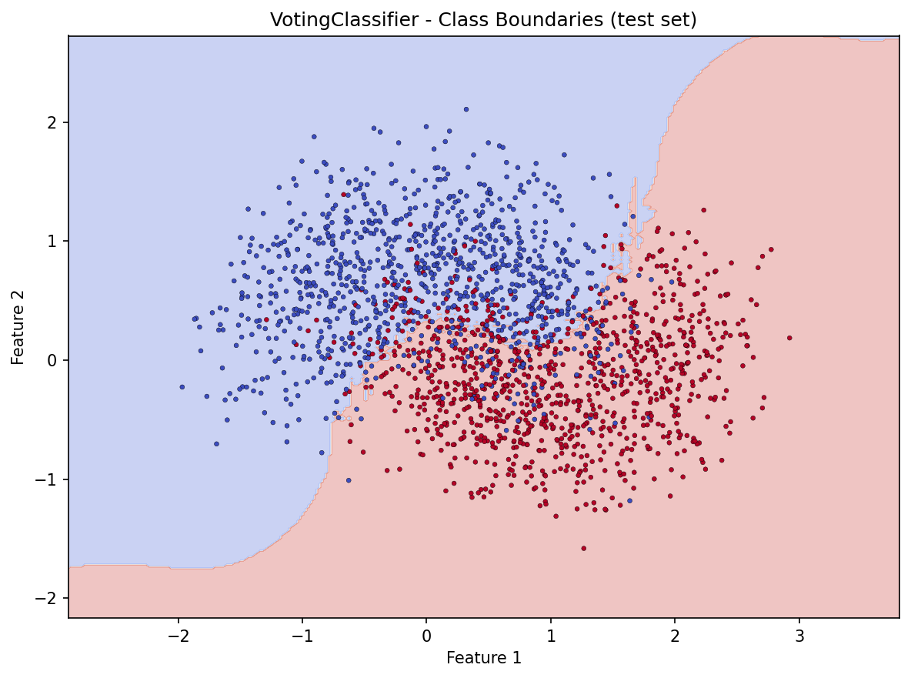
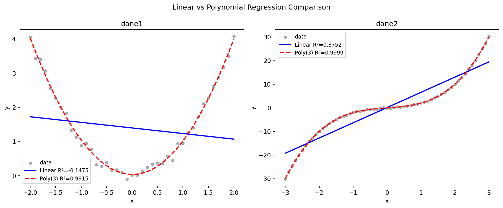

# sklearn_classifier_regressor_comparison_analyze

End-to-end **scikit-learn** workflows in Jupyter: **binary classification** on synthetic moons (multiple models + soft voting ensemble, train/test errors, decision-boundary plot) and **regression** on two tabular datasets comparing **linear** vs **degree-3 polynomial** models with **R²** on a held-out test split.

## Contents

| Path | Description |
|------|-------------|
| `program1.ipynb` | `make_moons` → `train_test_split` → `LogisticRegression`, `SVC`, `RandomForestClassifier`, `VotingClassifier` → error metrics → voting decision regions |
| `program2.ipynb` | Load `data/dane*.txt` → split → `LinearRegression` vs `PolynomialFeatures` + `LinearRegression` pipeline → `r2_score`, comparison plots |
| `data/` | Sample files `dane1.txt`, `dane2.txt` (`input output` per line) |
| `figures/` | Exported plots used below and in `analiz.typ` |
| `analiz.typ` / `analiz.pdf` | Long-form analysis (Typst) |

## Environment

Python 3 with `numpy`, `matplotlib`, `scikit-learn`, `jupyter`. Example:

```bash
python -m venv .venv
source .venv/bin/activate   # Windows: .venv\Scripts\activate
pip install numpy matplotlib scikit-learn jupyter
jupyter notebook program1.ipynb
```

## Program 1 — Classification

Train/test error rate is `1 - accuracy_score` (same `random_state=42` as the notebook).

| Model | Train error | Test error |
|-------|-------------|------------|
| LogisticRegression | 0.1703 | 0.1585 |
| SVM (RBF) | 0.1362 | 0.1260 |
| RandomForest | 0.0000 | 0.1495 |
| VotingClassifier (soft) | 0.1006 | 0.1295 |

`make_moons` is not linearly separable, so logistic regression lags; SVM and the forest capture non-linear structure; the forest can overfit the training set (near-zero train error). Soft **VotingClassifier** combines the three estimators and yields the decision map below (test points overlaid).



## Program 2 — Regression

Two datasets, `train_test_split(..., test_size=0.2, random_state=42)`, test **R²** with six decimals in the notebook printout. Summary (four decimals):

| Dataset | Linear (test) | Poly degree 3 (test) |
|---------|---------------|----------------------|
| dane1 | −0.1475 | 0.9915 |
| dane2 | 0.8752 | 0.9999 |

`dane2` polynomial **R²** is not exactly 1.0 (about **0.999895**); rounding to three decimals would show `1.000`, which overstates “perfect” fit. Both files are small (41 and 61 rows), so the test fold is tiny and a cubic model is very flexible relative to sample size.



## Analysis document

The Typst source `analiz.typ` matches the tables and discussion above; compile with [Typst](https://typst.app/) if you want to refresh `analiz.pdf`:

```bash
typst compile analiz.typ
```
